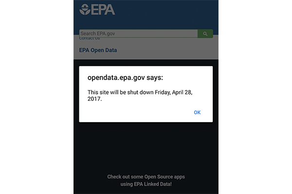

Polybius is a tool that lets you save webpages and compare them over time. It is main goal is to help journalist and activist document, track and analyze fragile digital content.

Polybius is not intended to be a repository of pages or a web archive. It's designed to help track and monitor relevant changes in information during specific periods of time.

## Fundamentals

TODO

## Usage

TODO

## Stack and Setup

Polybius uses MongoDB, Express 4.X, Angular 1.X and Node 6.X.

### Online Version:

A experimental alpha version is online at:

[polybius.3laab.com](polybius.3laab.com)

### Local Installation:
  - [Install MongoDB](https://www.mongodb.com/lp/download/mongodb-enterprise?jmp=nav)
  - [Install Node and NPM](https://docs.npmjs.com/getting-started/installing-node)
  - Clone this repo: `https://github.com/cvalenzuela/polybius.git`
  - `cd polybius`
  - `npm start`
  - Visit `localhost:3000`

## Polybius: the name

Polybius was a Greek historian of the Hellenistic period.

> "In the seventh volume of his Histories, Polybius defines the historian's job as the analysis of documentation, the review of relevant geographical information, and political experience" [source](https://en.wikipedia.org/wiki/Polybius)
